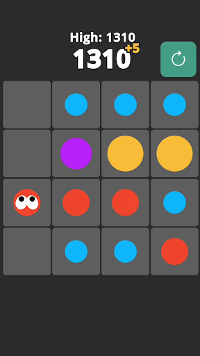
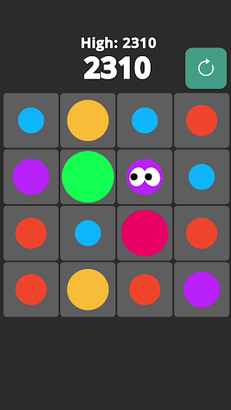
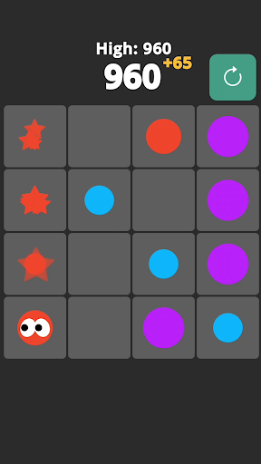

# Eyeballin' It

  
  
  

An Android-based puzzle game I created as a personal project with Godot Engine. Combine coloured circles and create lines to beat your high score!

## Special features
- Ad integration with the Godot AdMob addon and test units (banner, intersitial, rewarded)
- Tutorial section
- Personal high scores saved  to storage

## Setup

[Exporting for Android with Godot](https://docs.godotengine.org/en/stable/tutorials/export/exporting_for_android.html)
